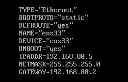
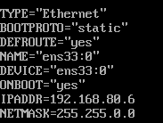
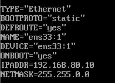
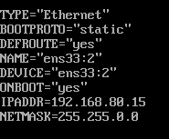

Harutiun
Hovsepyan
3ICS

# TP 1 - Service Web

## 2 - Désactivation de SELinux

**[2A] A quoi sert ce composant ?**

rep : SELinux est un mécanisme de sécurité qui améliore de manière la sécurité des serveurs sur lesquels il est déployé en apportant une couche supplémentaire aux traditionnels droits d’accès aux fichiers Unix.

**[2B] Comment peut on le désactiver momentanément (Il existe au moins 2 moyens)**

rep : Pour désactiver temporairement SElinux on peut entrer la commande `setenforce 0` ou la commande `echo "0" > /selinux/enforce`.

**[2C] Comment peut-on le désactiver de façon permanente ?**

rep : Pour désactiver Selinux de façon permanente, il faut entrer dans le fichier avec la commande `nano /etc/selinux/config`. Il faut ensuite editer `SELINUX=enforcing` en `SELINUX=permissive`.

---

## 3 - Désactivation permanente du pare-feu.

**[3A] Quelle commande vous permet de désactiver temporairement le firewall, le temps deprocéder a la configuration de la machine ?**

rep : Pour désactiver temporairement le firewall il faut entrer la commande `systemctl stop firewalld`.

**[3B] Quelle commande vous permet d’avoir la certitude que le firewall est bien inactif ?**

rep : La commande `systemctl is-active firewalld` nous permet d’avoir la certitude que le firewall est bien inactif. Si il nous renvoie `inactive`, alors tout est bon.

---

## 4 - Installation du service Apache (La configuration réseau avancé viendra par la suite)

**[4A] Quels sont les trois principaux serveurs WEB disponible sous Linux**

rep : Les trois principaux serveurs WEB disponible sous Linux sont Appache, MySql et PHP.

**[4B] La commande dnf (ou anciennement yum) permet d’installer les packages.**

**- Quelle commande permet de retrouver le nom du package contenant le serveur Apache ?**

rep : La commande `dnf search apache` nous permet de retrouver le nom du package contenant le serveur Apache.

**- Quelle commande permet d’installer le serveur Apache ?**

rep : Pour installer le serveur Apache on entre la commande `dnf install httpd`.

**[4C] Démarrage du service Apache**

**- Quelle commande permet de démarrer le service Apache ?**

rep : La commande `/sbin/service httpd start` permet de démarrer le service Apache.

**[4D] Quelle commande vous permet d’avoir la certitude que le service Apache est fonctionnel ?**

rep : La commande `/sbin/service httpd status` permet d’avoir la certitude que le service Apache est fonctionnel.

**[4E] Quelles informations essentielles vous sont fournies par cette commande ?**

rep : Cette commande nous fournies le PID du httpd, le port sur lequel il est active, son état,  etc...

---

## 5 - Configuration du service Apache

**[5A] Ou se trouvent les fichiers de configuration de Apache ?**

rep : Les fichiers de configuration de Apache se trouve dans le répertoire `/etc/httpd`.

**[5B] Quelle est la structure de ce répertoire ?**

rep : Dans ce réprertoire se trouve plusieurs répertoires : nous avons des réperoires qui contiennent des fichiers de configurations `.conf`, nous avons un réperoire de modules...

**[5C] Ou se trouve le fichier de configuration principal ?**

rep : Le fichier de configuration principal se trouve dans le répertoire `conf` et il se nomme `httpd.conf`.

**[5D] Que contient (du point de vue logique) le répertoire conf.d**

rep : Selon le `README` du répertoire `conf.d`, ce répertoire contient des fichier `.conf` qui sont des fichiers de configurations. Ce répertoire est utilisé en plus du répertoire `conf.modules.d`.
 

**[5E] Que contient le répertoire conf.modules.d**

rep : Le répertoire `conf.modules.d` contient des fichiers de configurations `.conf`. Ces fichiers permettent de cgargers des modules.

**[5F] Qu’est-ce qu’un module ?**

rep : Les modules sont des fonctionnalité qui peuvent être modifié selon notre besoin.

**[5G] Ou sont-ils stockés ?**

rep : Les modules sont stockés dans le répertoire `modules`

**[5H] Ou sont stockés les log de Apache ?**

rep : Les `log` de Apache sont stockés dans le répertoire `log`.

---

## 6 - Exploration de la configuration de base (fichier httpd.conf)

**[6A] Qu’est ce que le ‘DOCUMENT ROOT’ ?**

rep : Le `DocumentRoot` est la racine principale de l'arborescence des documents visible depuis Internet.

**[6B] Sur quel répertoire pointe-t-il ?**

rep : Le `DocumentRoot` pointe sur le répertoire `var/www/html`.

**[6C] A quoi sert la directive ‘Listen’**

rep : La directive `Listen` permet d'indiquer à httpd les adresses IP et ports sur lequelle il doit se mettre à l'écoute. Par défaut le serveur répond aux requêtes en provenance de toutes les interfaces réseau.

**[6D] A quoi sert la déclaration <Directory>**

rep : La déclaration `<Directory>` permet de regrouper un ensemble de directives qui ne s'appliquent qu'au répertoire précisé, à ses sous-répertoires et aux fichiers situés dans ces sous-répertoires.

**[6E] A quoi servent les directives ‘AllowOverride’ et ‘Require’ ?**

rep : La directive `AllowOverride` permet de controlé les directives autorisées dans les fichiers `.htaccess`. La directive `Require` vérifie si un utilisateur authentifié a une autorisation d'accès accordée par un fournisseur d'autorisation.

**[6F] A quoi sert le fichier welcome.conf ?**

rep : Le fichier `welcome.conf` est la page de bienvenue par défault si il n'y a pas de racine URL `index` par défault.

**[6G] A quoi sert la commande apachectl ?**

rep : La commande `apachectl` permet, entre autre, controler l'état de httpd en donnant en arguement les mots suivant `start`, `restart` et `stop`.

---

## 7 - Tests et Installations complémentaires

**[7A] Exécutez la commande yum install php -y , Quels packages sont installés ?**

rep : En exécutant la commande `yum install php -y` nous installons les packages `php` comme `php-fpm`, `php-common`, `php-cli`.

**[7B] Le service Apache utilise désormais systématiquement le package ‘php-fpm’ contenant les éléments nécessaires pour l’exécution de pages web dynamiques. Que contient ce package ?**

rep : Le package `php-fpm` contient les éléments nécessaires pour l’exécution de pages web dynamiques avec le service Apache.

**[7C] Comment prouver que le serveur Web est désormais capable d’exécuter du PHP ?**

rep : 

**[7D] Quelle version de php est installée ?**

rep : Pour connaitre la version de php installée, on entre la commande `php -v` ce qui nous donne `PHP 7.2.24`.

**[7E] Comment connaître la configuration compléte du serveur web (librairies installées, avec leurs versions et configurations?)**

rep : 

**[7F] Installez les packages et donnez le rôle des packages suivants :**

**- php-gd**

rep : Le package `php-gd` permet de manipuler des images dynamiquement avec php.

**- php-mysqlnd**

rep : Le package `php-mysqlnd` est un driver de langage de base de donnée.

**- php-pdo**

rep : Le package `php-pdo` permet de manipuler des bases de données en orienté objet avec php.

**- php-mbstring**

rep : Le package `php-mbstring` est une extension de php.

---

## 8 - Configuration avancée

**[8A] Installez le service vsftp, et bien sûr, vérifiez qu’il est opérationnel. Qu’avez vous fait comme commande ?**

rep : Pour installer service vsftp on entre la commande `yum install -y vsftpd`. Pour vérifier si elle est bien opérationnel on entre la commande `systemctl status vsftpd`. Si elle n'est pas activé, on entree la commande `systemctl start vsftpd`.

**[8B] Créez un compte utilisateur nommé ‘web’. Le répertoire de travail de l’utilisateur ‘web’ contiendra les dossiers hébergeant les différents sites web gérés par l’utilisateur ‘web’ :**

rep : Pour créer un utilisateur et le nommé en `web`, on va entrer la commande `useradd web`. On va lui attribuer un mot de passe avec la commande `passwd web`. Nous allons maintenant créer les répertoires demandée, pour ce faire nous allons utilier la commande `mkdir` suivit du nom de dossier que nous voullons créer.

**[8C] Vérifiez que vous pouvez accéder en lecture/écriture a tous les répertoires présents dans le répertoire /home/web en utilisant un client ftp comme FileZilla. Donnez les permissions de /home/web ainsi que celles des dossiers précédemment créés**

rep : Pour utiliser le client ftp FileZilla, nous allons installer FileZilla sur notre PC. Nous allons entrer dans la hôte l'ip de la VM, dans l'identifiant le nom de l'utilisateur `web` et dans le mot de passe le mot de passe de `web`. Nous accedons à notre VM via un client ftp qui est FileZilla.

Pour vérifier si nous avons accées en lécture/écriture, nous allons ouvrire un dossier et via FileZilla nous allons créer un fihier test.txt. Si sur la VM on voit apparaitre le fichier créeer précedement, cela prouve que nous avons accées en lécture/écriture.

---

## 9 - Configuration réseau

**[9A] Configurer votre carte réseau avec l’IP fixe 192.168.80.5/24 et donnez le contenu du fichier.**

rep : Voici le fichier configurer afin de configurer la carte réseau : 

**[9B] A quoi sert la commande nmcli**

rep : La commande `nmcli` permet de faire les manipulations précedent en ligne de commande.

**[9C] A quoi sert le service NetworkManager**

rep : Le service `NetworkManager` est un outil de gestion de réseau. Il permet entre autre de configurer et contrôler dynamiquement les appareils du réseau, la prise en charge d'une configuration, d'une gestion plus aisées...

**[9D] A quoi sert le fichier /etc/resolv.conf ?**

rep : Le fichier `/etc/resolv.conf` est générer par le service `NetworkManager`. Il permet de déterminer, entre autre, quels serveurs DNS utiliser pour résoudre un nom de domaine par exemple.

**[9E] Que devez-vous faire comme tests pour vérifier la connectivité de votre VM ?**

rep : Pour faire la vérification de la connectivité du VM, nous allons ping vers vers l'extérieur.

**[9F] Votre machine peut-elle joindre www.free.fr ? Quelle commande avez vous utilisez pour le vérifier ?**

rep : Pour joindre www.free.fr nous allons utiliser la commande `ping www.free.fr`. Nous pouvons constater que nos paquets ont bien joint www.free.fr.

**[9G] Votre VM peut-elle être jointe par l’un de vos collègues ? Si non, pourquoi ? Quels tests avez vous effectués ?**

rep : Je travail en local.

---

## 10 - IP Virtuelles

**[10A] Ajouter trois adresses IP virtuelles :**

- 192.168.80.6/16 permettant de contacter le site web www.campagne.sys :

rep : Voici le contenue du fichier ifcfg-ens33:0:

- 192.168.80.10/16 permettant de joindre www.montagne.sys et www.glacier.sys

rep : Voici le contenue du fichier /ifcfg-ens33:1 :

- 192.168.80.15/16 permettant de joindre www.sommet.sys

rep : Voici le contenue du fichier /ifcfg-ens33:2 :

**[10B] Comment prouver que votre configuration est fonctionnelle ?**

rep : 

---

## 11 - Configuration du premier serveur virtuel : serveur virtuel par IP

**[11A] Créez le premier serveur web virtuel. La racine (DocumentRoot) de ce serveur web sera bien sûr le répertoire www.campagne.sys. Donnez le nom et le contenu du fichier de configuration.**

rep :

**Prouvez que votre serveur virtuel est a l’écoute et joignable depuis une machine présente sur le réseau vmnet8. Quelle est votre démarche ?**

rep :

**Testez votre configuration en utilisant votre navigateur (depuis votre Windows ou depuis une autre VM). Pouvez-vous prouver que c’est bien le serveur virtuel que vous venez de configurer qui a répondu ? Comment ?**

rep :

**[11D] Votre serveur vous a retourné un message « access denied » ? C’est probablement normal, pourtant vous avez prouvé qu’il était a l’écoute :**

**- A quoi sert la directive « Allow » dans le fichier de configuration.**

rep :

**- Quelles sont les permissions sur le répertoire /home/web et /home/web/www.campagne.sys ?**

rep :

**- Proposez une solution « propre » pour résoudre le problème.**

rep :

**Déployez l’application web phpsysinfo (http://phpsysinfo.github.io/phpsysinfo/) dans le répertoire www.campagne.sys et fournissez une copie d’écran de la page d’accueil de cette application.**

rep :

**Testez l’URL http:// 172 .16. xxx .5 Avez vous obtenu une réponse ? Si Oui pourquoi ?**

rep :

---

## 12 - Serveur virtuel par nom

**Créer les deux serveurs webs virtuels répondant pour le domaine www.montagne.sys et www.glacier.sys sur l’IP 172.16.xxx.10 et donnez le contenu du/des fichier·s de configuration.**

rep :

**Avez vous vu la note concernant la configuration des DNS ? Donnez-en un résumé**

rep :

**Mettez en place une solution permettant de garantir que le serveur virtuel hébergeant www.montagne.sys est bien le bon a répondre et procédez aux tests. Justifiez votre démarche.**

rep :

**Testez l’URL http://172.16. xxx .5 . Quel serveur virtuel a répondu ? Est-ce le comportement attendu ? Justifiez votre réponse.**

rep :

**Avez vous vu la note intitulée « Le serveur principal disparaît » ? Quelle information essentiel contient-elle ?**

rep :

---

## 13 - Serveur virtuel, HTTPS et SSL
